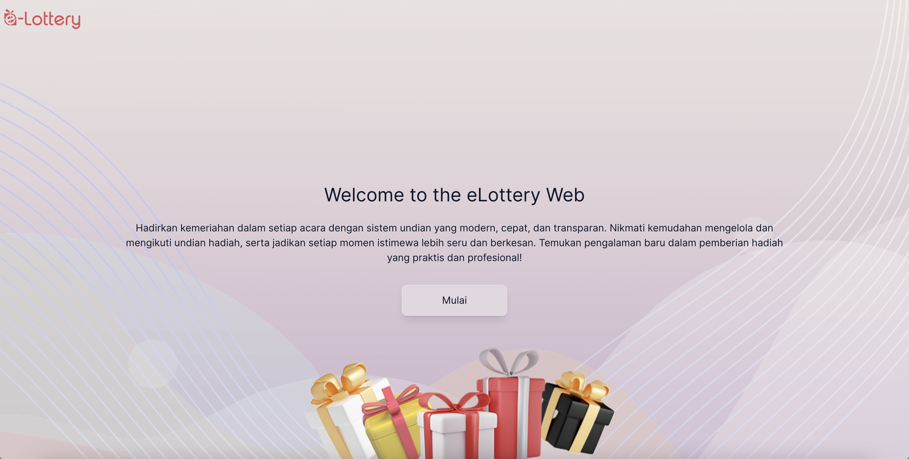

# E-lottery website

Created at : 28 October 2024

## Introduction

Hi, my name is Septian. 
I'm and applied Software Engineer. I built apps to improve processes in Mining industry
I've been working in the coal mining industry since 2012  in the Supply Chain Management Department. So many things going around in material management. Managing goods is like several knowledge applications combined. However, hundreds of thousands of dollars invested by the company, so we cannot mess around with the poor quality of the material management system.  

## Goals
Basicly, we have an annual gathering event, and I was assigned as one of the doorprize team. Our duty is to share hundreds of prize to the participants which is the employees of the company. Last year I bought some kind of lottery software. Unfortunately I can't run the software everywhere I want because it's a windows based executable program. So I ask myself, why not create it in the web version so I run anywhere with my own data with me? At the beginning, my purpose is to create the web app that do the job for us privately, later I decided to make it open source so that people can use it for good. So if you make your way here, congratulations for not having to buy the software like I did :D.

## Outline
This web app is crafted using React JS, which is known for its flexibility and scalability.

## Changelog

28 October 2024 - MVP

